# Class Diagram — API Layer

This diagram shows the full internal structure of `HomeLabManager.API`:
controllers, services, repositories, interfaces, and the scraping provider pipeline.

```mermaid
classDiagram
    direction TB

    %% ── Controllers ──────────────────────────────────────────────────────────
    class DevicesController {
        -DeviceService deviceService
        -ILogger~DevicesController~ logger
        +Register(IFormFile file) IActionResult
        +RegisterManual(ManualDeviceRegisterRequest) IActionResult
        +GetDevices() ActionResult
        +GetDeviceById(Guid id) ActionResult
        +GetDeviceStats() IActionResult
        +DeleteDevice(Guid id) IActionResult
        +UpdateDevice(Guid id, UpdateDeviceRequest) IActionResult
    }

    class ComponentsController {
        -ComponentService componentService
        +GetAll() ActionResult
        +GetById(Guid id) ActionResult
        +Create(Component) ActionResult
        +Update(Guid id, Component) ActionResult
        +Delete(Guid id) ActionResult
        +GetByComponentType(string) ActionResult
        +GetByVendor(Guid vendorId) ActionResult
    }

    class DeviceComponentsController {
        -DeviceComponentService deviceComponentService
        +GetComponentsByDevice(Guid deviceId) ActionResult
        +GetDevicesByComponent(Guid componentId) ActionResult
        +GetById(Guid id) ActionResult
        +AddComponentToDevice(DeviceComponent) ActionResult
        +Update(Guid id, DeviceComponent) ActionResult
        +RemoveComponentFromDevice(Guid id) ActionResult
    }

    class ScraperController {
        -IScraperService scraperService
        -ScanServiceInterface scanService
        +Search(ScraperSearchRequest) ActionResult
        +FromImage(IFormFile file) ActionResult
    }

    class VendorsController {
        -ApplicationDBContext dbContext
        -ILogger~VendorsController~ logger
        +GetVendors() ActionResult
        +DeduplicateVendors() ActionResult
    }

    %% ── Services ──────────────────────────────────────────────────────────────
    class DeviceService {
        -ScanServiceInterface scanService
        -VendorLookupInterface vendorLookup
        -DeviceRepositoryInterface deviceRepository
        -ApplicationDBContext dbContext
        +RegisterDeviceAsync(Stream) Task~DeviceResponseDTO~
        +RegisterManualDeviceAsync(ManualDeviceRegisterRequest) Task~DeviceResponseDTO~
        +GetAllDevicesAsync() Task~List~DeviceResponseDTO~~
        +GetDeviceByIdAsync(Guid) Task~DeviceResponseDTO~
        +UpdateDeviceAsync(Guid, UpdateDeviceRequest) Task~DeviceResponseDTO~
        +DeleteDeviceByIdAsync(Guid) Task~bool~
        +GetDeviceStatsAsync() Task~DeviceStatsResponse~
    }

    class ComponentService {
        -ComponentRepositoryInterface repository
        +GetAllComponentsAsync() Task~IEnumerable~Component~~
        +GetComponentByIdAsync(Guid) Task~Component~
        +CreateComponentAsync(Component) Task~Component~
        +UpdateComponentAsync(Component) Task~Component~
        +DeleteComponentAsync(Guid) Task~bool~
        +GetComponentsByTypeAsync(string) Task~IEnumerable~Component~~
        +GetComponentsByVendorIdAsync(Guid) Task~IEnumerable~Component~~
    }

    class DeviceComponentService {
        -DeviceComponentRepositoryInterface deviceComponentRepository
        -DeviceRepositoryInterface deviceRepository
        -ComponentRepositoryInterface componentRepository
        +GetComponentsByDeviceIdAsync(Guid) Task~IEnumerable~DeviceComponent~~
        +GetDevicesByComponentIdAsync(Guid) Task~IEnumerable~DeviceComponent~~
        +GetByIdAsync(Guid) Task~DeviceComponent~
        +AddComponentToDeviceAsync(DeviceComponent) Task~DeviceComponent~
        +UpdateAsync(DeviceComponent) Task~DeviceComponent~
        +RemoveComponentFromDeviceAsync(Guid) Task~bool~
    }

    class ScraperService {
        -IEnumerable~IHardwareLookupProvider~ providers
        +LookupDeviceAsync(string query, string codeType) Task~ScrapeResult~
    }

    %% ── Interfaces ────────────────────────────────────────────────────────────
    class DeviceRepositoryInterface {
        <<interface>>
        +AddAsync(Device) Task
        +GetAllAsync() Task~List~Device~~
        +GetDeviceByIdAsync(Guid) Task~Device~
        +GetForUpdateByIdAsync(Guid) Task~Device~
        +SerialExistsAsynch(string) Task~bool~
        +DeleteByIdAsync(Guid) Task~bool~
    }

    class ComponentRepositoryInterface {
        <<interface>>
        +GetAllAsync() Task~IEnumerable~Component~~
        +GetByIdAsync(Guid) Task~Component~
        +CreateAsync(Component) Task~Component~
        +UpdateAsync(Component) Task~Component~
        +DeleteAsync(Guid) Task~bool~
        +GetByTypeAsync(string) Task~IEnumerable~Component~~
        +GetByVendorIdAsync(Guid) Task~IEnumerable~Component~~
    }

    class DeviceComponentRepositoryInterface {
        <<interface>>
        +GetComponentsByDeviceIdAsync(Guid) Task~IEnumerable~DeviceComponent~~
        +GetDevicesByComponentIdAsync(Guid) Task~IEnumerable~DeviceComponent~~
        +GetByIdAsync(Guid) Task~DeviceComponent~
        +AddComponentToDeviceAsync(DeviceComponent) Task~DeviceComponent~
        +UpdateAsync(DeviceComponent) Task~DeviceComponent~
        +RemoveComponentFromDeviceAsync(Guid) Task~bool~
    }

    class ScanServiceInterface {
        <<interface>>
        +ExtractSerialAsync(ScanRequest) Task~string~
    }

    class VendorLookupInterface {
        <<interface>>
        +GetProductBySerialAsync(string serial) Task~Product~
    }

    class IScraperService {
        <<interface>>
        +LookupDeviceAsync(string query, string codeType) Task~ScrapeResult~
    }

    class IHardwareLookupProvider {
        <<interface>>
        +CanHandle(string codeType, string? vendor) bool
        +SearchAsync(string query, string? vendor) Task~ScrapeResult~
    }

    %% ── Concrete Repositories ────────────────────────────────────────────────
    class DeviceRepository {
        -ApplicationDBContext dbContext
    }
    class ComponentRepository {
        -ApplicationDBContext dbContext
    }
    class DeviceComponentRepository {
        -ApplicationDBContext dbContext
    }
    class ScanService
    class FakeVendorLookupTest

    %% ── Scraping Providers ───────────────────────────────────────────────────
    class UpcLookupProvider
    class HpeSerialLookupProvider
    class DellSerialLookupProvider
    class CiscoSerialLookupProvider
    class WebSearchFallbackProvider

    %% ── Controller → Service wiring ─────────────────────────────────────────
    DevicesController --> DeviceService
    ComponentsController --> ComponentService
    DeviceComponentsController --> DeviceComponentService
    ScraperController --> IScraperService
    ScraperController --> ScanServiceInterface
    VendorsController --> ApplicationDBContext

    %% ── Service → Interface dependencies ────────────────────────────────────
    DeviceService --> ScanServiceInterface
    DeviceService --> VendorLookupInterface
    DeviceService --> DeviceRepositoryInterface
    DeviceService --> ApplicationDBContext

    ComponentService --> ComponentRepositoryInterface

    DeviceComponentService --> DeviceComponentRepositoryInterface
    DeviceComponentService --> DeviceRepositoryInterface
    DeviceComponentService --> ComponentRepositoryInterface

    ScraperService ..|> IScraperService
    ScraperService --> IHardwareLookupProvider

    %% ── Interface → Implementation ──────────────────────────────────────────
    DeviceRepository ..|> DeviceRepositoryInterface
    ComponentRepository ..|> ComponentRepositoryInterface
    DeviceComponentRepository ..|> DeviceComponentRepositoryInterface
    ScanService ..|> ScanServiceInterface
    FakeVendorLookupTest ..|> VendorLookupInterface

    UpcLookupProvider ..|> IHardwareLookupProvider
    HpeSerialLookupProvider ..|> IHardwareLookupProvider
    DellSerialLookupProvider ..|> IHardwareLookupProvider
    CiscoSerialLookupProvider ..|> IHardwareLookupProvider
    WebSearchFallbackProvider ..|> IHardwareLookupProvider
```

## Notes

- Fake/test implementations (`FakeVendorLookupTest`, `FakeHardwareLookupProvider`, etc.) are registered only in test projects.
- `VendorsController` directly uses `ApplicationDBContext` because vendor deduplication requires a transactional multi-step query that doesn't benefit from an extra service layer.
- `ScraperService` receives **all** `IHardwareLookupProvider` implementations as an `IEnumerable` via dependency injection and iterates through them in priority order.
