# Class Diagram — API Layer

This diagram shows the full internal structure of `HomeLabManager.API`:
controllers, services, repositories, interfaces, and the scraping provider pipeline.
The layout flows **top-to-bottom** through four architectural tiers.

```mermaid
flowchart TD
    %% ── TIER 1 · Controllers ────────────────────────────────────────────────
    subgraph CTRL["🎮  Controllers  (HTTP entry points)"]
        direction TB
        DC["<b>DevicesController</b>
        ────────────────────
        POST /register · POST /manual
        GET / · GET /{id} · GET /stats
        PUT /{id} · DELETE /{id}"]

        CC["<b>ComponentsController</b>
        ────────────────────
        GET / · GET /{id} · POST /
        PUT /{id} · DELETE /{id}
        GET /type/{t} · GET /vendor/{id}"]

        DCC["<b>DeviceComponentsController</b>
        ────────────────────
        GET /device/{id} · GET /component/{id}
        GET /{id} · POST /
        PUT /{id} · DELETE /{id}"]

        SC["<b>ScraperController</b>
        ────────────────────
        POST /search
        POST /from-image"]

        VC["<b>VendorsController</b>
        ────────────────────
        GET /
        POST /deduplicate"]
    end

    %% ── TIER 2 · Services ───────────────────────────────────────────────────
    subgraph SVC["⚙️  Services  (Business logic)"]
        direction TB
        DS["<b>DeviceService</b>
        ────────────────────
        RegisterDeviceAsync(stream)
        RegisterManualDeviceAsync(req)
        GetAllDevicesAsync()
        GetDeviceByIdAsync(id)
        UpdateDeviceAsync(id, req)
        DeleteDeviceByIdAsync(id)
        GetDeviceStatsAsync()"]

        CS["<b>ComponentService</b>
        ────────────────────
        GetAllComponentsAsync()
        GetComponentByIdAsync(id)
        CreateComponentAsync(c)
        UpdateComponentAsync(c)
        DeleteComponentAsync(id)
        GetComponentsByTypeAsync(t)
        GetComponentsByVendorIdAsync(id)"]

        DCS["<b>DeviceComponentService</b>
        ────────────────────
        GetComponentsByDeviceIdAsync(id)
        GetDevicesByComponentIdAsync(id)
        GetByIdAsync(id)
        AddComponentToDeviceAsync(dc)
        UpdateAsync(dc)
        RemoveComponentFromDeviceAsync(id)"]

        SS["<b>ScraperService</b>
        ────────────────────
        LookupDeviceAsync(query, codeType)
        ↳ iterates IHardwareLookupProvider chain"]
    end

    %% ── TIER 3 · Interfaces & Repositories ─────────────────────────────────
    subgraph REPO["🗄️  Repository Interfaces  →  Implementations"]
        direction TB
        DRI["«interface»
        <b>DeviceRepositoryInterface</b>
        ────────────────────
        AddAsync · GetAllAsync
        GetDeviceByIdAsync · GetForUpdateByIdAsync
        SerialExistsAsynch · DeleteByIdAsync"]
        DevRepo["<b>DeviceRepository</b>
        implements ↑"]

        CRI["«interface»
        <b>ComponentRepositoryInterface</b>
        ────────────────────
        GetAllAsync · GetByIdAsync
        CreateAsync · UpdateAsync
        DeleteAsync · GetByTypeAsync
        GetByVendorIdAsync"]
        CompRepo["<b>ComponentRepository</b>
        implements ↑"]

        DCRI["«interface»
        <b>DeviceComponentRepositoryInterface</b>
        ────────────────────
        GetComponentsByDeviceIdAsync
        GetDevicesByComponentIdAsync
        GetByIdAsync · AddComponentToDeviceAsync
        UpdateAsync · RemoveComponentFromDeviceAsync"]
        DCRepo["<b>DeviceComponentRepository</b>
        implements ↑"]

        SSI["«interface»
        <b>ScanServiceInterface</b>
        ────────────────────
        ExtractSerialAsync(request)"]
        ScanSvc["<b>ScanService</b>
        implements ↑"]

        VLI["«interface»
        <b>VendorLookupInterface</b>
        ────────────────────
        GetProductBySerialAsync(serial)"]
        FVL["<b>FakeVendorLookupTest</b>
        implements ↑  (test only)"]

        DBC["<b>ApplicationDBContext</b>
        (EF Core DbContext)
        ────────────────────
        DbSet: Devices · Products
        Vendors · Components
        DeviceComponents"]
    end

    %% ── TIER 4 · Scraping Pipeline ──────────────────────────────────────────
    subgraph SCRAPE["🔍  Scraping Pipeline"]
        direction TB
        ISS["«interface»
        <b>IScraperService</b>
        ────────────────────
        LookupDeviceAsync(query, codeType)"]

        IHL["«interface»
        <b>IHardwareLookupProvider</b>
        ────────────────────
        CanHandle(codeType, vendor)
        SearchAsync(query, vendor)"]

        P1["<b>UpcLookupProvider</b>
        handles: Upc codes"]
        P2["<b>HpeSerialLookupProvider</b>
        handles: SerialNumber + HPE"]
        P3["<b>DellSerialLookupProvider</b>
        handles: SerialNumber + Dell"]
        P4["<b>CiscoSerialLookupProvider</b>
        handles: SerialNumber + Cisco"]
        P5["<b>WebSearchFallbackProvider</b>
        handles: any SerialNumber"]
    end

    %% ── CONNECTIONS · Controller → Service ──────────────────────────────────
    DC -->|uses| DS
    CC -->|uses| CS
    DCC -->|uses| DCS
    SC -->|uses| SS
    SC -->|uses| SSI
    VC -->|uses| DBC

    %% ── CONNECTIONS · Service → Repository / Interface ──────────────────────
    DS -->|uses| SSI
    DS -->|uses| VLI
    DS -->|uses| DRI
    DS -->|uses| DBC
    CS -->|uses| CRI
    DCS -->|uses| DCRI
    DCS -->|uses| DRI
    DCS -->|uses| CRI
    SS -->|implements| ISS
    SS -->|iterates| IHL

    %% ── CONNECTIONS · Interfaces → Implementations ──────────────────────────
    DRI -.->|impl| DevRepo
    CRI -.->|impl| CompRepo
    DCRI -.->|impl| DCRepo
    SSI -.->|impl| ScanSvc
    VLI -.->|impl| FVL

    %% ── CONNECTIONS · Providers → Interface ─────────────────────────────────
    IHL -.->|impl| P1
    IHL -.->|impl| P2
    IHL -.->|impl| P3
    IHL -.->|impl| P4
    IHL -.->|impl| P5

    %% ── Styles ──────────────────────────────────────────────────────────────
    classDef controller fill:#dbeafe,stroke:#3b82f6,color:#1e3a5f
    classDef service    fill:#ede9fe,stroke:#8b5cf6,color:#3b0764
    classDef repo       fill:#d1fae5,stroke:#10b981,color:#064e3b
    classDef iface      fill:#fef9c3,stroke:#d97706,color:#78350f
    classDef provider   fill:#fee2e2,stroke:#ef4444,color:#7f1d1d

    class DC,CC,DCC,SC,VC controller
    class DS,CS,DCS,SS service
    class DevRepo,CompRepo,DCRepo,ScanSvc,FVL,DBC repo
    class DRI,CRI,DCRI,SSI,VLI,ISS,IHL iface
    class P1,P2,P3,P4,P5 provider
```

## Notes

- **Solid arrows** (`-->`) = runtime dependency (uses / calls).
- **Dashed arrows** (`-.->`) = implementation relationship (interface → concrete class).
- `VendorsController` depends directly on `ApplicationDBContext` because vendor deduplication uses a multi-step transaction that is simpler without a separate service layer.
- `ScraperService` receives **all** `IHardwareLookupProvider` implementations as an `IEnumerable` via dependency injection and tries them in priority order until one succeeds.
- Fake/test implementations (`FakeVendorLookupTest`, etc.) are wired up only in the test project.
