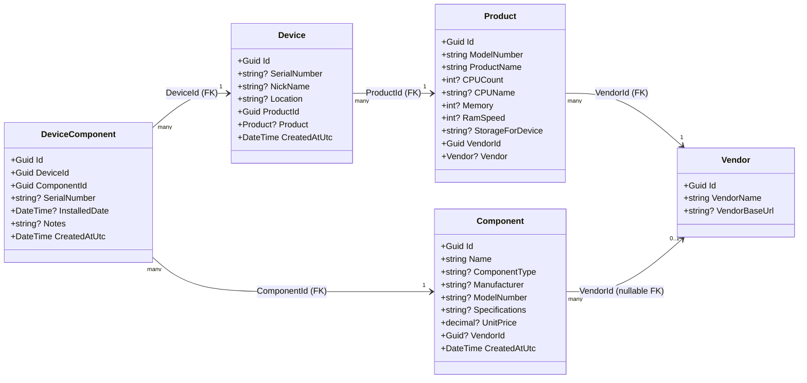

# Class Diagram — Core Domain Entities

This diagram shows the five domain entities that live in `HomeLabManager.Core/Entities/`
and how they relate to each other in the database.

## Key Points

- **Device** is the central asset being tracked. It always links to a **Product** (model info) and through that to a **Vendor**.
- **Product** holds hardware-specification metadata (CPU, RAM, storage) sourced from a vendor lookup or entered manually.
- **Vendor** is the manufacturer/supplier. The same vendor row is reused (deduplicated) across many products and components.
- **Component** tracks individual parts (CPU, RAM, NIC, etc.) that can be independently purchased and installed.
- **DeviceComponent** is the join table that records *which* component is installed in *which* device, along with installation metadata (serial number, date, notes).
