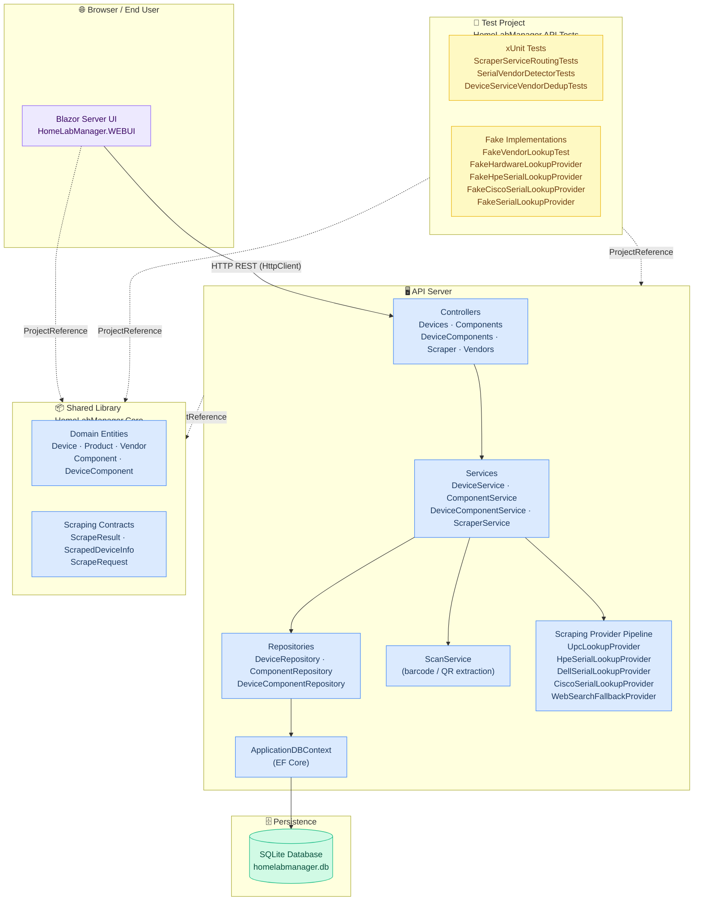

# Component Diagram — System Overview

This diagram shows the high-level runtime components of HomeLabManager,
how they are organised into projects, and how data flows between them.

## Component Responsibilities

| Component | Project | Responsibility |
|-----------|---------|----------------|
| **Blazor UI** | WEBUI | Renders pages (Dashboard, Devices, Components, Vendors, Register, Settings). Communicates with the API via `HttpClient`. |
| **Controllers** | API | Thin HTTP boundary — validates HTTP input, delegates to services, maps results to HTTP responses. |
| **Services** | API | Business logic — orchestration, validation rules, cross-entity consistency. |
| **Repositories** | API | Data access — EF Core queries isolated behind interfaces for testability. |
| **ScanService** | API | Decodes barcodes/QR codes from uploaded images using a scanning library. |
| **Scraping Pipeline** | API | Chain of `IHardwareLookupProvider` implementations tried in order (UPC database → vendor-specific serial APIs → web-search fallback). |
| **ApplicationDBContext** | API | EF Core DbContext; owns the schema migration and table mapping. |
| **Core Entities** | Core | Plain C# POCO domain models shared by API and WEBUI with no external dependencies. |
| **Scraping Contracts** | Core | DTOs and result objects for the scraping pipeline, also shared across projects. |
| **SQLite DB** | — | Single-file embedded database; ideal for home-lab / single-node deployment. |
