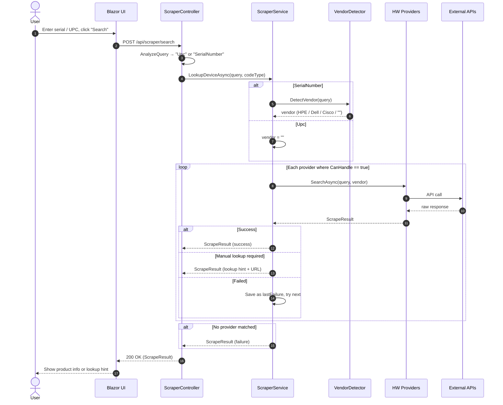

# Sequence Diagram — Hardware Scraping / Lookup Pipeline

This diagram shows how the scraper feature works — either from a text query
(serial number or UPC) entered on the Scraper page, or from an uploaded image.

## Path A — Text Search



## Path B — Image-Based Scrape Preview

```mermaid
sequenceDiagram
    autonumber
    actor User
    participant UI as Blazor UI
    participant API as ScraperController
    participant Scan as ScanService
    participant Svc as ScraperService
    participant Pvd as HW Providers
    participant Ext as External APIs

    User->>UI: Upload device image
    UI->>API: POST /api/scraper/from-image

    API->>Scan: ExtractSerialAsync(imageStream)
    Scan-->>API: extractedCode

    API->>API: AnalyzeExtractedCode(code)
    note right of API: URL → not supported
        All digits → Upc
        Alphanumeric → SerialNumber
        Other → Unknown

    alt Cannot attempt lookup
        API-->>UI: 200 OK (CanAttemptLookup: false)
        UI-->>User: Show code + reason
    end

    API->>Svc: LookupDeviceAsync(code, codeType)
    Svc->>Pvd: Provider chain (same as Path A)
    Pvd->>Ext: API call
    Ext-->>Pvd: response
    Pvd-->>Svc: ScrapeResult
    Svc-->>API: ScrapeResult

    API-->>UI: 200 OK (ImageScrapePreviewResponse)
    UI-->>User: Show preview (product, model, image, URL)
```

## Provider Priority Order

| Priority | Provider | Handles | Notes |
|----------|----------|---------|-------|
| 1 | `UpcLookupProvider` | `Upc` codes | Calls UPC database REST API |
| 2 | `HpeSerialLookupProvider` | `SerialNumber` + vendor=HPE | HPE product lookup API |
| 3 | `DellSerialLookupProvider` | `SerialNumber` + vendor=Dell | Dell support API |
| 4 | `CiscoSerialLookupProvider` | `SerialNumber` + vendor=Cisco | Cisco coverage check API |
| 5 | `WebSearchFallbackProvider` | Any `SerialNumber` | Generic web-search fallback |

`SerialVendorDetector` inspects the serial number prefix/pattern to identify the vendor before the provider chain is consulted, allowing the right vendor-specific provider to be selected first.
