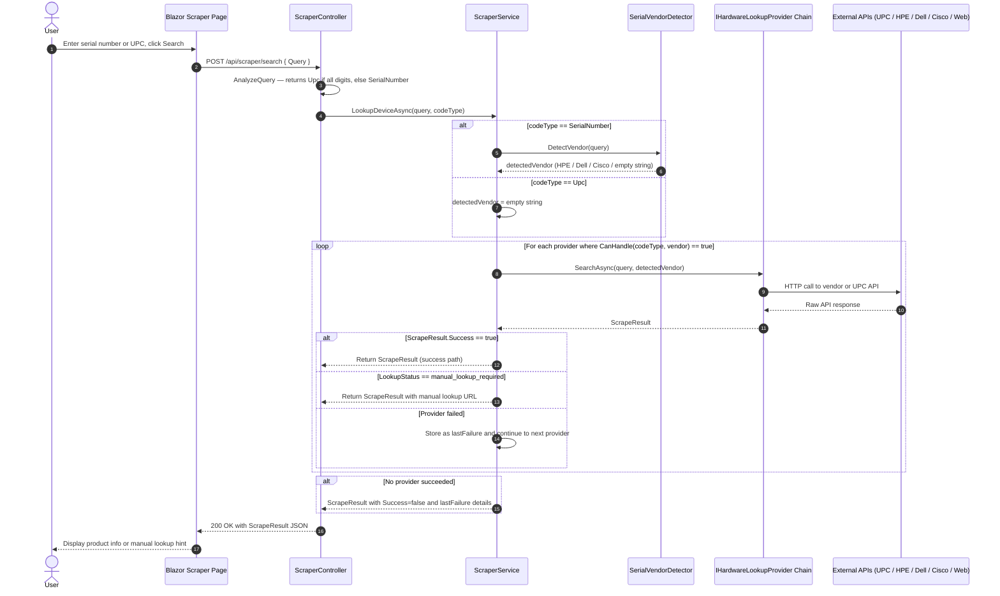
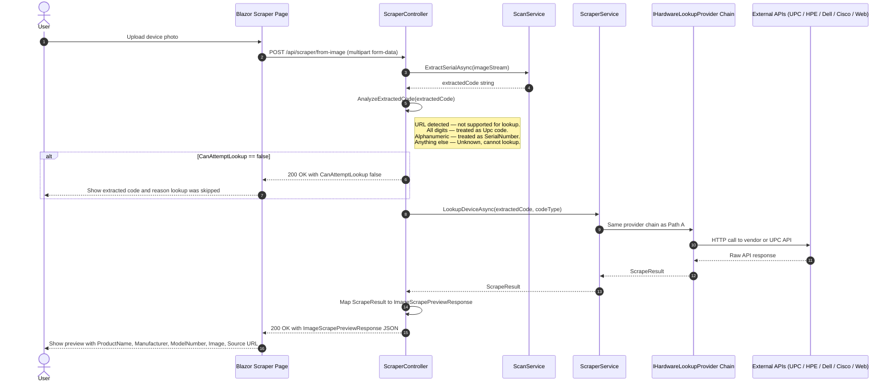

# Sequence Diagram — Hardware Scraping / Lookup Pipeline

This diagram shows how the scraper feature works — either from a text query
(serial number or UPC) entered on the Scraper page, or from an uploaded image.

## Path A — Text Search

## Path B — Image-Based Scrape Preview

## Provider Priority Order

| Priority | Provider | Handles | Notes |
|----------|----------|---------|-------|
| 1 | `UpcLookupProvider` | `Upc` codes | Calls UPC database REST API |
| 2 | `HpeSerialLookupProvider` | `SerialNumber` + vendor=HPE | HPE product lookup API |
| 3 | `DellSerialLookupProvider` | `SerialNumber` + vendor=Dell | Dell support API |
| 4 | `CiscoSerialLookupProvider` | `SerialNumber` + vendor=Cisco | Cisco coverage check API |
| 5 | `WebSearchFallbackProvider` | Any `SerialNumber` | Generic web-search fallback |

`SerialVendorDetector` inspects the serial number prefix/pattern to identify the vendor before the provider chain is consulted, allowing the right vendor-specific provider to be selected first.
