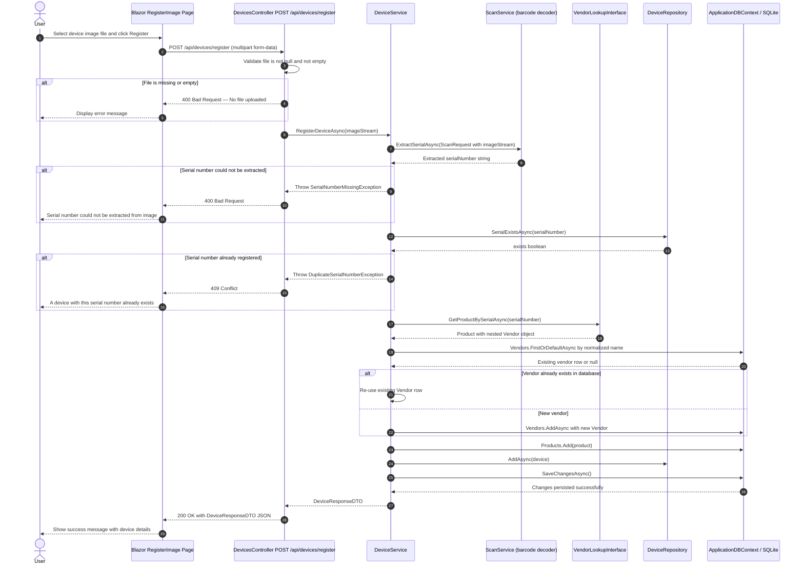

# Sequence Diagram — Image-Based Device Registration

This diagram shows the end-to-end flow when a user uploads a photo of a device
label to register it automatically via barcode/QR-code scanning.

## Error Paths Summary

| Step | Exception | HTTP Status | User Message |
|------|-----------|-------------|--------------|
| File missing/empty | — | 400 | "No file uploaded." |
| No barcode found in image | `BarcodeNotFoundException` | 400 | Barcode error detail |
| Image processing fails | `FileScanningUploadException` | 400 | Upload error detail |
| Serial not extracted | `SerialNumberMissingException` | 400 | "Serial number could not be extracted…" |
| Duplicate serial | `DuplicateSerialNumberException` | 409 | "A device with the same serial number already exists." |
| Unexpected error | `Exception` | 500 | Generic server error |
