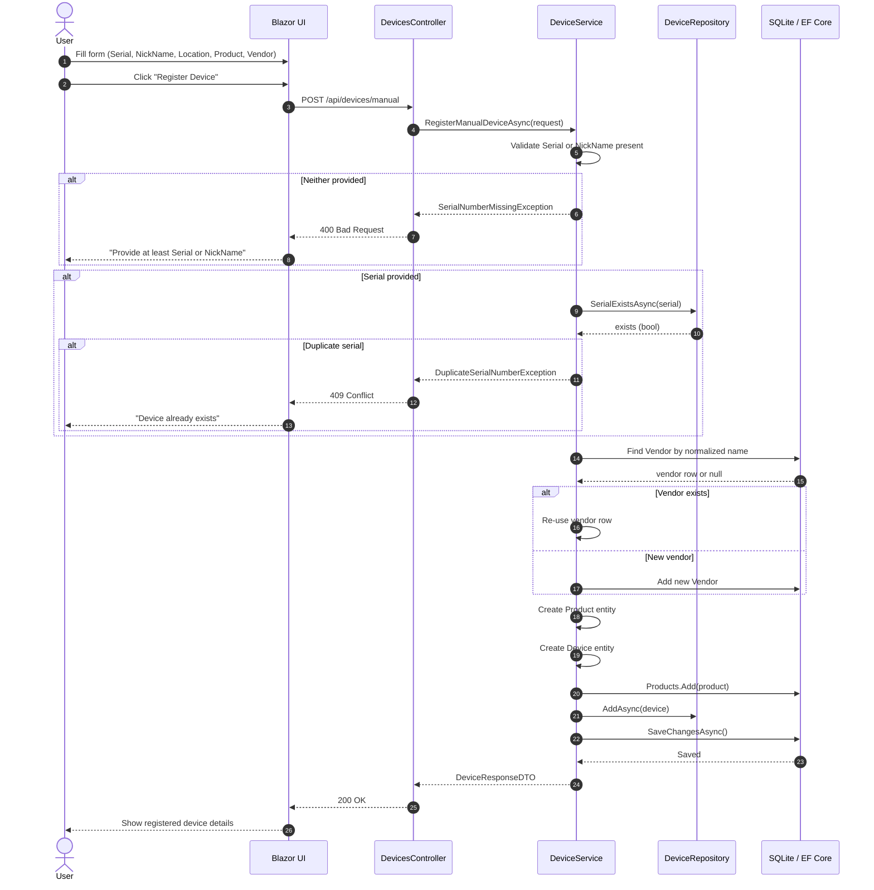

# Sequence Diagram — Manual Device Registration

This diagram shows the flow when a user fills in the device details manually
through the **Register Manually** form instead of uploading an image.

## ManualDeviceRegisterRequest Fields

| Field | Required | Notes |
|-------|----------|-------|
| `SerialNumber` | At least one of Serial or NickName | Checked for duplicates if supplied |
| `NickName` | At least one of Serial or NickName | Human-friendly label |
| `Location` | Optional | Rack unit, room, etc. |
| `ProductName` | Optional | Defaults to `"Unknown Product"` |
| `ModelNumber` | Optional | Defaults to `"Unknown Model"` |
| `VendorName` | Optional | Defaults to `"ManualEntry"`; reuses existing vendor row if name matches |
