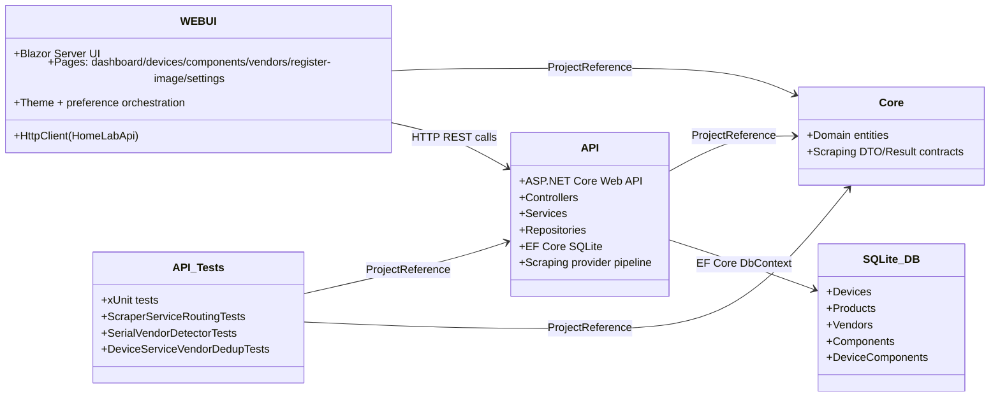
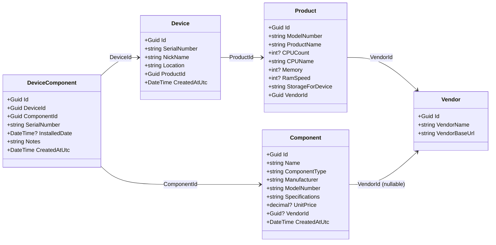
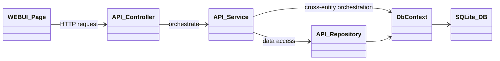

# HomeLabManager Structural UML

## 1) Solution Component Diagram

```mermaid
classDiagram
    direction LR

    class API_Tests {
      +xUnit tests
      +ScraperServiceRoutingTests
      +SerialVendorDetectorTests
      +DeviceServiceVendorDedupTests
    }

    class WEBUI {
      +Blazor Server UI
      +Pages: dashboard/devices/components/vendors/register-image/settings
      +HttpClient(HomeLabApi)
      +Theme + preference orchestration
    }

    class API {
      +ASP.NET Core Web API
      +Controllers
      +Services
      +Repositories
      +EF Core SQLite
      +Scraping provider pipeline
    }

    class Core {
      +Domain entities
      +Scraping DTO/Result contracts
    }

    class SQLite_DB {
      +Devices
      +Products
      +Vendors
      +Components
      +DeviceComponents
    }

    API --> Core : ProjectReference
    WEBUI --> Core : ProjectReference
    API_Tests --> API : ProjectReference
    API_Tests --> Core : ProjectReference

    WEBUI --> API : HTTP REST calls
    API --> SQLite_DB : EF Core DbContext
```

## 2) API Layer Structure

```mermaid
classDiagram
    direction TB

    class DevicesController
    class ComponentsController
    class DeviceComponentsController
    class ScraperController
    class VendorsController

    class DeviceService
    class ComponentService
    class DeviceComponentService
    class ScraperService

    class ApplicationDBContext

    class DeviceRepositoryInterface
    class ComponentRepositoryInterface
    class DeviceComponentRepositoryInterface
    class VendorLookupInterface
    class ScanServiceInterface
    class IScraperService
    class IHardwareLookupProvider

    class DeviceRepository
    class ComponentRepository
    class DeviceComponentRepository
    class ScanService
    class FakeVendorLookupTest

    class UpcLookupProvider
    class HpeSerialLookupProvider
    class DellSerialLookupProvider
    class CiscoSerialLookupProvider
    class WebSearchFallbackProvider
    class FakeHardwareLookupProvider
    class FakeHpeSerialLookupProvider
    class FakeCiscoSerialLookupProvider
    class FakeSerialLookupProvider

    DevicesController --> DeviceService
    ComponentsController --> ComponentService
    DeviceComponentsController --> DeviceComponentService
    ScraperController --> IScraperService
    ScraperController --> ScanServiceInterface
    VendorsController --> ApplicationDBContext

    DeviceService --> ScanServiceInterface
    DeviceService --> VendorLookupInterface
    DeviceService --> DeviceRepositoryInterface
    DeviceService --> ApplicationDBContext

    ComponentService --> ComponentRepositoryInterface
    DeviceComponentService --> DeviceComponentRepositoryInterface
    DeviceComponentService --> DeviceRepositoryInterface
    DeviceComponentService --> ComponentRepositoryInterface

    ScraperService ..|> IScraperService
    ScraperService --> IHardwareLookupProvider : IEnumerable

    DeviceRepository ..|> DeviceRepositoryInterface
    ComponentRepository ..|> ComponentRepositoryInterface
    DeviceComponentRepository ..|> DeviceComponentRepositoryInterface
    ScanService ..|> ScanServiceInterface
    FakeVendorLookupTest ..|> VendorLookupInterface

    UpcLookupProvider ..|> IHardwareLookupProvider
    HpeSerialLookupProvider ..|> IHardwareLookupProvider
    DellSerialLookupProvider ..|> IHardwareLookupProvider
    CiscoSerialLookupProvider ..|> IHardwareLookupProvider
    WebSearchFallbackProvider ..|> IHardwareLookupProvider
    FakeHardwareLookupProvider ..|> IHardwareLookupProvider
    FakeHpeSerialLookupProvider ..|> IHardwareLookupProvider
    FakeCiscoSerialLookupProvider ..|> IHardwareLookupProvider
    FakeSerialLookupProvider ..|> IHardwareLookupProvider
```

## 3) Core Domain Model Diagram

```mermaid
classDiagram
    direction LR

    class Device {
      +Guid Id
      +string SerialNumber
      +string NickName
      +string Location
      +Guid ProductId
      +DateTime CreatedAtUtc
    }

    class Product {
      +Guid Id
      +string ModelNumber
      +string ProductName
      +int? CPUCount
      +string CPUName
      +int? Memory
      +int? RamSpeed
      +string StorageForDevice
      +Guid VendorId
    }

    class Vendor {
      +Guid Id
      +string VendorName
      +string VendorBaseUrl
    }

    class Component {
      +Guid Id
      +string Name
      +string ComponentType
      +string Manufacturer
      +string ModelNumber
      +string Specifications
      +decimal? UnitPrice
      +Guid? VendorId
      +DateTime CreatedAtUtc
    }

    class DeviceComponent {
      +Guid Id
      +Guid DeviceId
      +Guid ComponentId
      +string SerialNumber
      +DateTime? InstalledDate
      +string Notes
      +DateTime CreatedAtUtc
    }

    Device --> Product : ProductId
    Product --> Vendor : VendorId
    Component --> Vendor : VendorId (nullable)
    DeviceComponent --> Device : DeviceId
    DeviceComponent --> Component : ComponentId
```

## 4) Runtime Request Flow (Typical)

```mermaid
classDiagram
    direction LR

    class WEBUI_Page
    class API_Controller
    class API_Service
    class API_Repository
    class DbContext
    class SQLite_DB

    WEBUI_Page --> API_Controller : HTTP request
    API_Controller --> API_Service : orchestrate
    API_Service --> API_Repository : data access
    API_Service --> DbContext : cross-entity orchestration
    API_Repository --> DbContext
    DbContext --> SQLite_DB
```
