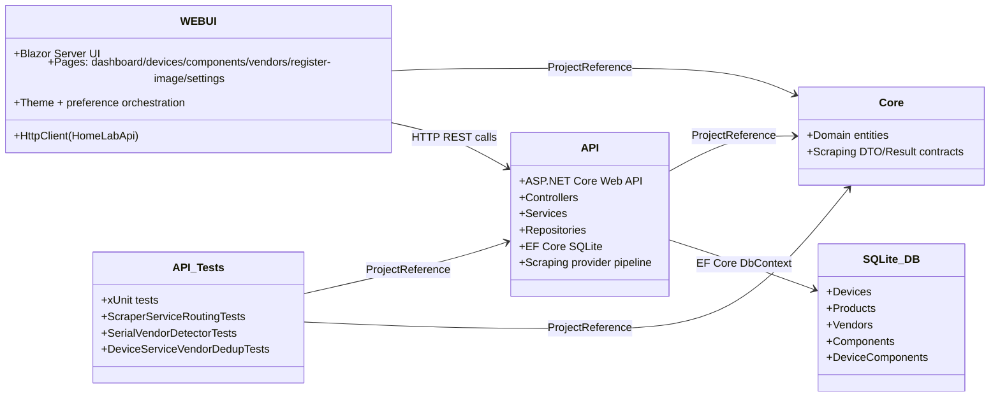
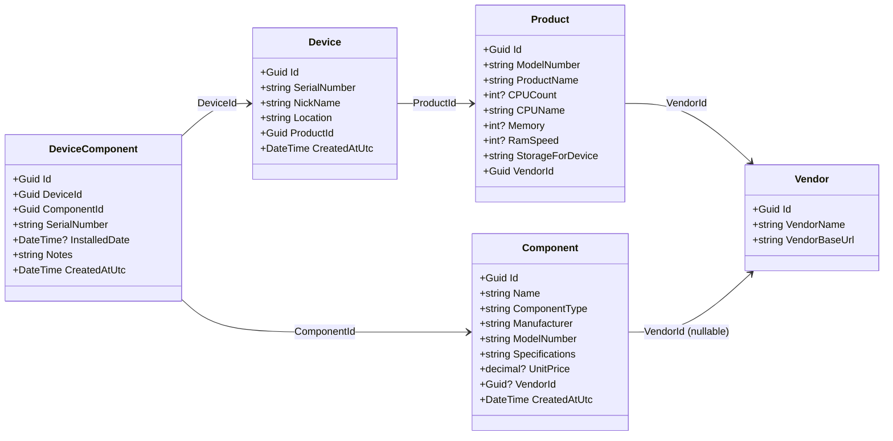
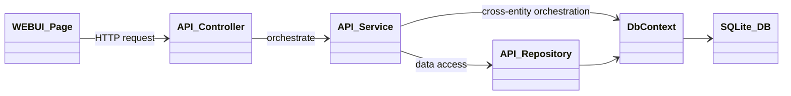

# HomeLabManager Structural UML

> **📂 Detailed diagrams** are available in [`docs/diagrams/`](diagrams/README.md).
> The diagrams below provide a concise overview; the linked folder contains
> fully-annotated class diagrams, sequence diagrams, and a component diagram.

## 1) Solution Component Diagram

## 2) API Layer Structure

```mermaid
flowchart TD
    subgraph CTRL["🎮  Controllers"]
        direction TB
        DC["DevicesController"]
        CC["ComponentsController"]
        DCC["DeviceComponentsController"]
        SC["ScraperController"]
        VC["VendorsController"]
    end

    subgraph SVC["⚙️  Services"]
        direction TB
        DS["DeviceService"]
        CS["ComponentService"]
        DCS["DeviceComponentService"]
        SS["ScraperService"]
    end

    subgraph REPO["🗄️  Repository Interfaces  →  Implementations"]
        direction TB
        DRI["«interface» DeviceRepositoryInterface"] -.->|impl| DevRepo["DeviceRepository"]
        CRI["«interface» ComponentRepositoryInterface"] -.->|impl| CompRepo["ComponentRepository"]
        DCRI["«interface» DeviceComponentRepositoryInterface"] -.->|impl| DCRepo["DeviceComponentRepository"]
        SSI["«interface» ScanServiceInterface"] -.->|impl| ScanSvc["ScanService"]
        VLI["«interface» VendorLookupInterface"] -.->|impl| FVL["FakeVendorLookupTest (test only)"]
        DBC["ApplicationDBContext (EF Core)"]
    end

    subgraph SCRAPE["🔍  Scraping Pipeline"]
        direction TB
        ISS["«interface» IScraperService"] -.->|impl| SS2["ScraperService"]
        IHL["«interface» IHardwareLookupProvider"]
        IHL -.->|impl| P1["UpcLookupProvider"]
        IHL -.->|impl| P2["HpeSerialLookupProvider"]
        IHL -.->|impl| P3["DellSerialLookupProvider"]
        IHL -.->|impl| P4["CiscoSerialLookupProvider"]
        IHL -.->|impl| P5["WebSearchFallbackProvider"]
    end

    DC --> DS
    CC --> CS
    DCC --> DCS
    SC --> ISS
    SC --> SSI
    VC --> DBC

    DS --> SSI
    DS --> VLI
    DS --> DRI
    DS --> DBC
    CS --> CRI
    DCS --> DCRI
    DCS --> DRI
    DCS --> CRI
    SS --> ISS
    SS --> IHL

    classDef controller fill:#dbeafe,stroke:#3b82f6,color:#1e3a5f
    classDef service    fill:#ede9fe,stroke:#8b5cf6,color:#3b0764
    classDef repo       fill:#d1fae5,stroke:#10b981,color:#064e3b
    classDef iface      fill:#fef9c3,stroke:#d97706,color:#78350f
    classDef provider   fill:#fee2e2,stroke:#ef4444,color:#7f1d1d

    class DC,CC,DCC,SC,VC controller
    class DS,CS,DCS,SS service
    class DevRepo,CompRepo,DCRepo,ScanSvc,FVL,DBC,SS2 repo
    class DRI,CRI,DCRI,SSI,VLI,ISS,IHL iface
    class P1,P2,P3,P4,P5 provider
```

## 3) Core Domain Model Diagram

## 4) Runtime Request Flow (Typical)

